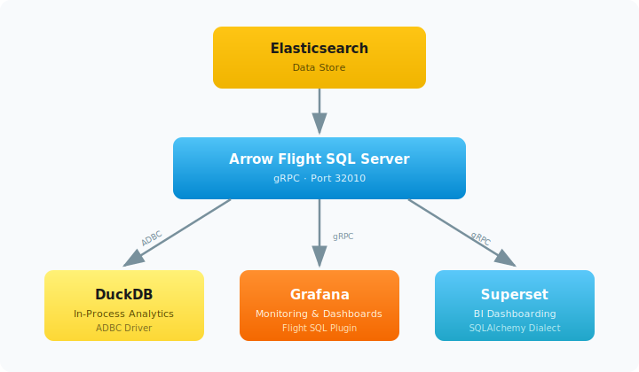

# SoftClient4ES Integration Demos

Docker Compose demos showcasing Elasticsearch SQL access via [Arrow Flight SQL](https://arrow.apache.org/docs/format/FlightSql.html).

## Prerequisites

- Docker and Docker Compose v2+
- ~4 GB free RAM (Elasticsearch + demo services)

## Architecture



All profiles share a common Elasticsearch instance with preloaded e-commerce sample data (20 orders).

## Profiles

### Superset — BI Dashboarding via Flight SQL

```bash
docker compose --profile superset-flight up
```

| Service       | URL                   |
|---------------|-----------------------|
| Superset UI   | http://localhost:8088 |
| Elasticsearch | http://localhost:9200 |

**Login:** `admin` / `admin123`

The init script automatically:
- Bootstraps the Superset database
- Creates the admin user
- Configures an Arrow Flight SQL datasource
- Registers the `ecommerce` table as a dataset
- Creates 6 demo charts and an **E-Commerce Analytics** dashboard

Navigate to **Dashboards** to see the pre-built analytics, **SQL Lab** to run ad-hoc queries, or **Datasets** to explore the data model.

### Grafana — Monitoring & Dashboarding via Flight SQL

```bash
docker compose --profile grafana up
```

| Service       | URL                   |
|---------------|-----------------------|
| Grafana UI    | http://localhost:3000 |
| Elasticsearch | http://localhost:9200 |

**Login:** `admin` / `admin123`

Grafana starts with the [influxdata-flightsql-datasource](https://github.com/influxdata/grafana-flightsql-datasource) plugin pre-installed and a provisioned **E-Commerce Analytics (Flight SQL)** dashboard featuring:

- KPI stats (total orders, revenue, avg order value, unique customers)
- Revenue by Country (bar chart)
- Orders by Category (pie chart)
- Revenue by Category (bar chart)
- Order Status (donut chart)
- Avg Order Value by Payment Method (bar chart)
- Top Customers by Spend (table)

All panels use raw SQL queries executed via Arrow Flight SQL. Navigate to **Explore** to run ad-hoc SQL queries against Elasticsearch.

### DuckDB — In-Process Analytics

```bash
docker compose --profile duckdb up
```

Runs a Python demo script that:
1. Connects to the Flight SQL server via `adbc_driver_flightsql`
2. Fetches Arrow tables from Elasticsearch
3. Registers them in DuckDB for local analytical queries
4. Demonstrates zero-copy Arrow data flow: ES → Flight SQL → DuckDB

Output is printed directly to the console.

## Configuration

Edit `.env` to change versions:

```env
# Elasticsearch version (full)
ES_VERSION=8.18.3

# Major version (selects the Flight SQL server image)
ES_MAJOR_VERSION=8
```

Available Flight SQL server images:

- `softnetwork/softclient4es6-arrow-flight-sql:latest`
- `softnetwork/softclient4es7-arrow-flight-sql:latest`
- `softnetwork/softclient4es8-arrow-flight-sql:latest`
- `softnetwork/softclient4es9-arrow-flight-sql:latest`

## Cleanup

```bash
# Stop and remove containers
docker compose --profile superset-flight down
docker compose --profile grafana down
docker compose --profile duckdb down

# Remove volumes (data)
docker compose --profile superset-flight down -v
docker compose --profile grafana down -v
docker compose --profile duckdb down -v
```

## Sample Data

The `ecommerce` index contains 20 orders with the following fields:

| Field            | Type    | Example              |
|------------------|---------|----------------------|
| `order_id`       | keyword | ORD-001              |
| `order_date`     | date    | 2025-01-15T10:30:00Z |
| `customer_name`  | keyword | Alice Martin         |
| `country`        | keyword | France               |
| `city`           | keyword | Paris                |
| `category`       | keyword | Electronics          |
| `product_name`   | text    | Wireless Headphones  |
| `quantity`       | integer | 2                    |
| `unit_price`     | double  | 79.99                |
| `total_price`    | double  | 159.98               |
| `payment_method` | keyword | Credit Card          |
| `status`         | keyword | delivered            |

### Example Queries

```sql
-- Revenue by country
SELECT country, COUNT(*) as orders, SUM(total_price) as revenue
FROM ecommerce
GROUP BY country
ORDER BY revenue DESC

-- Top categories
SELECT category, SUM(total_price) as revenue
FROM ecommerce
GROUP BY category
ORDER BY revenue DESC

-- Order status breakdown
SELECT status, COUNT(*) as ct
FROM ecommerce
GROUP BY status
```
